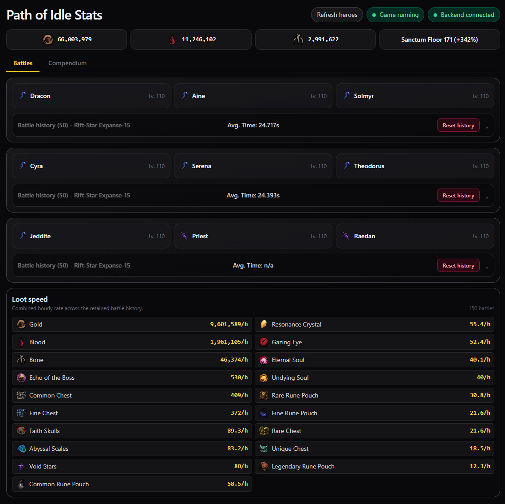
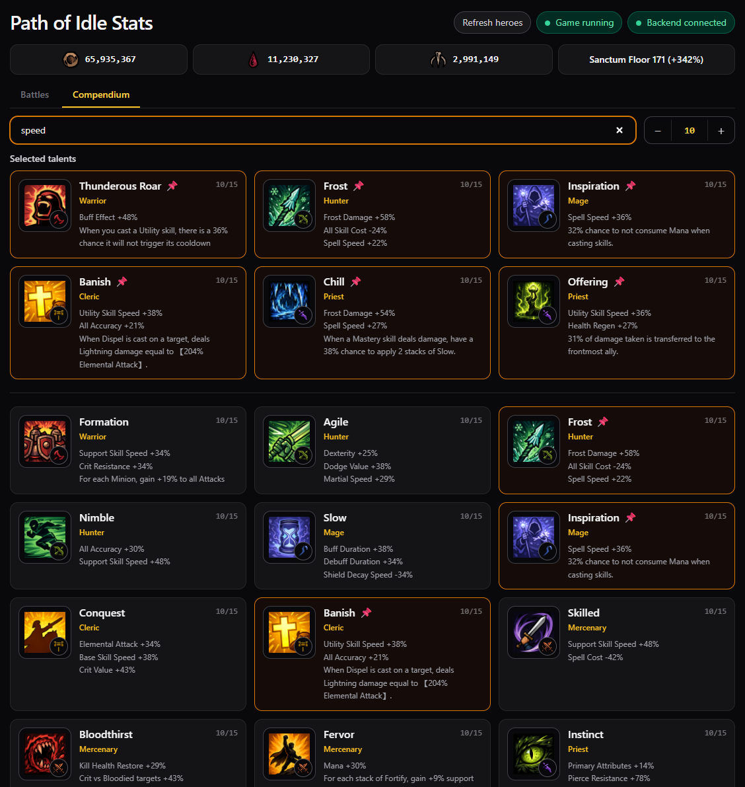
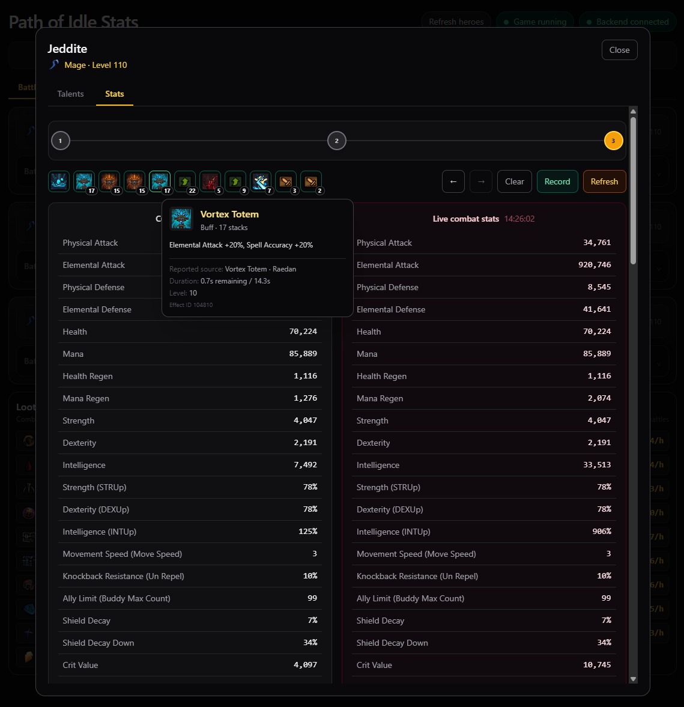

# Install and use Path of Idle Stats

This guide is for Windows players who are not developers. Follow the steps in order. Commands shown in a box can be copied and pasted into **PowerShell**.

## What this mod does

Path of Idle Stats reads live gameplay information and displays it in a local dashboard at `http://127.0.0.1:43127`.

<p align="center">
  
  
  
</p>

- It shows battle slots, heroes, talents, stats, battle history, loot speed, and resources.
- It reads game state only. It does not edit or inspect save files.
- Its server listens only on your PC (`127.0.0.1`); it is not exposed to your network.
- Installing or updating the plugin requires the game to be closed. Running the dashboard does not.

## Before you begin

You need:

1. **Path of Idle: Old Gods Rising**, installed through Steam.
2. **Node.js LTS**, from [nodejs.org](https://nodejs.org/). Use the normal Windows installer and accept its defaults.
3. **A current .NET SDK**, from [dotnet.microsoft.com/download](https://dotnet.microsoft.com/download). Choose **.NET SDK for Windows x64**, not only the Desktop Runtime.
4. The public project repository: [https://github.com/kpapadatos/path-of-idle-stats](https://github.com/kpapadatos/path-of-idle-stats).
5. The official BepInEx file named `BepInEx-Unity.IL2CPP-win-x64-6.0.0-be.760+a1afbfb.zip`.

The instructions assume Steam installed the game here:

```text
C:\Program Files (x86)\Steam\steamapps\common\PathOfIdle
```

To check, open Steam, right-click the game, and select **Manage → Browse local files**. If a different folder opens, substitute that folder wherever this guide shows the path above.

## Part 1: Download the project

1. Open [https://github.com/kpapadatos/path-of-idle-stats](https://github.com/kpapadatos/path-of-idle-stats).
2. Select **Code → Download ZIP**.
3. Open the downloaded ZIP.
4. Extract its project folder to `C:\r`.
5. Rename the extracted folder to `path-of-idle-stats` if necessary.

You should now have:

```text
C:\r\path-of-idle-stats\package.json
C:\r\path-of-idle-stats\start.bat
```

## Part 2: Prepare the dashboard

1. Open the Windows Start menu.
2. Search for **PowerShell** and open it. Administrator mode is normally unnecessary.
3. Copy and paste these commands:

```powershell
Set-Location 'C:\r\path-of-idle-stats'
npm install
npm run build
```

This can take several minutes the first time. It is successful when it says `Application bundle generation complete` without a red error.

## Part 3: Download and verify BepInEx

Download BepInEx only from the [official BepInEx build site](https://builds.bepinex.dev/projects/bepinex_be) or the [official BepInEx GitHub organization](https://github.com/BepInEx). Do not use a repack from a mod-download mirror.

Required archive:

```text
BepInEx-Unity.IL2CPP-win-x64-6.0.0-be.760+a1afbfb.zip
```

Its expected SHA-256 fingerprint is:

```text
9753B825578A3C3A31CC10067CD45A44A7BF56D3C34C4679E24D6ADFD0FBA8EA
```

Create `C:\r\path-of-idle-stats\work\downloads`, place the ZIP there, then verify it in PowerShell:

```powershell
Set-Location 'C:\r\path-of-idle-stats'
(Get-FileHash '.\work\downloads\BepInEx-Unity.IL2CPP-win-x64-6.0.0-be.760+a1afbfb.zip' -Algorithm SHA256).Hash
```

Continue only if the displayed fingerprint exactly matches the expected fingerprint above.

Extract the archive into:

```text
C:\r\path-of-idle-stats\work\bepinex
```

After extraction, this exact file must exist:

```text
C:\r\path-of-idle-stats\work\bepinex\BepInEx\core\BepInEx.Unity.IL2CPP.dll
```

If an extra folder level appears between `bepinex` and `BepInEx`, move the archive's contents up one level.

## Part 4: Install BepInEx and generate game support files

1. Fully close Path of Idle.
2. In File Explorer, open `C:\r\path-of-idle-stats\work\bepinex`.
3. Select everything inside that folder and copy it.
4. Open the Path of Idle game folder.
5. Paste the files beside `PathOfIdle.exe`.
6. Start the game normally through Steam.
7. Wait until the main menu appears. A small BepInEx console window may appear during this first bootstrap launch.
8. Close the game normally.
9. Disable that console for future launches while retaining file logs:

```powershell
Set-Location 'C:\r\path-of-idle-stats'
.\scripts\configure-bepinex.ps1
```

This first launch creates the game-specific support files needed to build the Stats plugin. Confirm this folder now exists:

```text
C:\Program Files (x86)\Steam\steamapps\common\PathOfIdle\BepInEx\interop
```

## Part 5: Build and install the Stats plugin

Keep the game closed. In PowerShell, run:

```powershell
Set-Location 'C:\r\path-of-idle-stats'
.\scripts\build-plugin.ps1
New-Item -ItemType Directory -Force 'C:\Program Files (x86)\Steam\steamapps\common\PathOfIdle\BepInEx\plugins' | Out-Null
Copy-Item '.\plugin\bin\Release\net6.0\PathOfIdleStats.dll' 'C:\Program Files (x86)\Steam\steamapps\common\PathOfIdle\BepInEx\plugins\PathOfIdleStats.dll' -Force
```

It is installed when this file exists:

```text
C:\Program Files (x86)\Steam\steamapps\common\PathOfIdle\BepInEx\plugins\PathOfIdleStats.dll
```

## Part 6: Start and use the dashboard

For normal daily use:

1. Double-click `C:\r\path-of-idle-stats\start.bat`.
2. Leave its terminal window open.
3. Open [http://127.0.0.1:43127](http://127.0.0.1:43127) in a browser.
4. Start Path of Idle through Steam.
5. Enter your save.

The dashboard should populate after the save loads. Battles update it automatically. Select **Refresh heroes** to request hero, talent, combat-stat, slot, and resource information immediately instead of waiting for a battle to finish.

The **Game running** indicator turns green while the plugin is active. It normally changes to **Game stopped** within five seconds after the game closes. **Backend connected** means the local dashboard server is available.

To stop the dashboard, select its terminal window and press `Ctrl+C`, or close the window. This does not affect the game or save.

## Updating the mod

1. Close Path of Idle.
2. Download and extract the newest project source over `C:\r\path-of-idle-stats`, or use `git pull` if you cloned it with Git.
3. Open PowerShell and run:

```powershell
Set-Location 'C:\r\path-of-idle-stats'
npm install
npm run build
.\scripts\build-plugin.ps1
Copy-Item '.\plugin\bin\Release\net6.0\PathOfIdleStats.dll' 'C:\Program Files (x86)\Steam\steamapps\common\PathOfIdle\BepInEx\plugins\PathOfIdleStats.dll' -Force
```

4. Restart `start.bat` if it was running.
5. Start the game again.

BepInEx usually does not need to be reinstalled when only Stats changes.

## Troubleshooting

### The dashboard does not open

- Confirm the `start.bat` terminal is still open.
- Look for `Path of Idle Stats: http://127.0.0.1:43127` in that window.
- Try [http://127.0.0.1:43127/api/health](http://127.0.0.1:43127/api/health). A small JSON response means the server is working.
- If `npm` is not recognized, reinstall Node.js LTS and restart Windows.
- If port `43127` is already in use, close older Stats terminal windows and start it again.

### The dashboard opens but contains no game data

- Start the game and enter the save; the main menu alone is not enough.
- Select **Refresh heroes**.
- Confirm `PathOfIdleStats.dll` is in `BepInEx\plugins`.
- Open `BepInEx\LogOutput.log` in Notepad and search for `PathOfIdleStats` or `error`.
- Restart the game after every plugin DLL update.

### Icons are missing

Icons are extracted locally from the installed game and are intentionally not stored in Git. Core telemetry can work while some icons are absent. A maintainer may provide or generate the local `data\icons` cache for the same game version.

### A large number of BepInEx errors appears

Confirm that you installed the pinned **Unity IL2CPP Windows x64** BepInEx archive, not the Mono build or an archive for another platform. Do not delete game files. Close the game and ask the maintainer to inspect `BepInEx\LogOutput.log`.

### PowerShell says scripts are disabled

Open PowerShell normally and run this temporary, window-only setting, then retry the command in the same window:

```powershell
Set-ExecutionPolicy -Scope Process -ExecutionPolicy Bypass
```

This does not permanently change the computer's execution policy.

## Uninstalling

Uninstalling does not require deleting or opening your save.

1. Close Path of Idle.
2. Delete only this file:

```text
C:\Program Files (x86)\Steam\steamapps\common\PathOfIdle\BepInEx\plugins\PathOfIdleStats.dll
```

3. Delete `C:\r\path-of-idle-stats` if you also want to remove the dashboard and its locally recorded telemetry.

Leave the rest of `BepInEx` installed if another mod uses it. If Stats was the only BepInEx mod and you want to remove BepInEx itself, use Steam's **Verify integrity of game files** feature or ask the maintainer for help rather than deleting unfamiliar game-folder files manually.

## Privacy and saved data

- Stats never intentionally sends telemetry outside your PC.
- Local battle events may include hero names, equipment, and gameplay history under `C:\r\path-of-idle-stats\data`.
- Deleting that `data` folder while the server is stopped removes Stats' recorded telemetry and generated catalogs. It does not delete game progress.
- Game save files are outside this project and are never part of installation or uninstallation.
