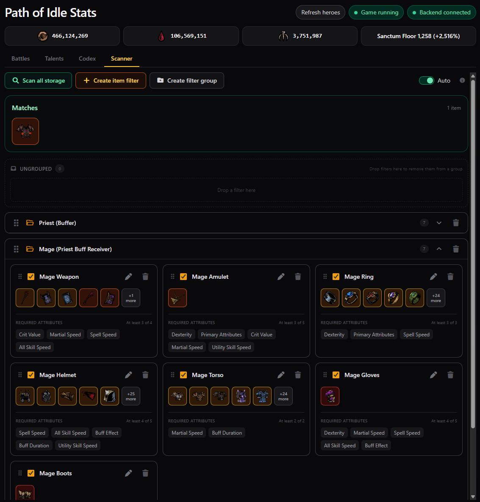

# Path of Idle Stats

Path of Idle Stats reads live gameplay information from **Path of Idle: Old Gods Rising** and displays it in a local dashboard at [http://127.0.0.1:43127](http://127.0.0.1:43127).

<p align="center">
  
  
  
  
</p>

It includes battle slots and history, loot rates, resources, hero talents and live stats, combat effects, per-skill damage meters, a talent compendium, item Codex, and inventory/warehouse scanner.

## One-step installation and startup

You need Windows, Steam, and Path of Idle installed through Steam. **You do not need Node.js, npm, .NET, or a separate BepInEx download.**

1. Open [https://github.com/kpapadatos/path-of-idle-stats](https://github.com/kpapadatos/path-of-idle-stats).
2. Select **Code → Download ZIP** and extract the ZIP somewhere permanent.
3. Close Path of Idle if it is running. This is required only when installing or updating the game plugin.
4. Double-click **`start.bat`**.

That is all. `start.bat` automatically:

1. Finds Steam using the Windows registry.
2. Searches Steam's configured library folders for app `4243990`.
3. Verifies `PathOfIdle.exe`, `GameAssembly.dll`, and `PathOfIdle_Data` before accepting the directory.
4. Installs the bundled, pinned BepInEx runtime when it is not already installed.
5. Installs or updates only `BepInEx\plugins\PathOfIdleStats.dll`.
6. Starts the bundled local server.
7. Opens the dashboard in your default browser.

Leave the terminal window open while using the dashboard. Start the game through Steam and enter your save. The dashboard's **Game running** indicator turns green when telemetry begins.

For normal daily use, double-click `start.bat` again. It detects an existing current installation and starts the dashboard without copying files again. If the dashboard is already running, it simply opens it.

## Safety

- The installer never opens, edits, moves, or deletes save files.
- It verifies the Steam app and multiple game files before installing anything.
- It refuses to copy or update the plugin while that game executable is running.
- It never overwrites a different or partial BepInEx installation.
- Existing BepInEx files are left unchanged after a compatible installation is detected.
- The plugin observes game state; it does not change gameplay or save state.
- The server listens only on `127.0.0.1`, so it is not exposed to your network.
- Local history, scanner settings, and catalogs stay in this project's ignored `data` folder. Referenced icons are extracted locally from the running game into `<game>\BepInEx\PathOfIdleStats\icons`; they are never downloaded or uploaded.

The bundled runtime provenance and fingerprints are recorded in [`vendor/THIRD-PARTY.md`](vendor/THIRD-PARTY.md). BepInEx is the pinned Unity IL2CPP Windows x64 build `6.0.0-be.760+a1afbfb`; Node.js is the pinned Windows x64 runtime `22.22.2`.

## Updating

1. Close Path of Idle.
2. Replace the extracted project files with the latest release/source ZIP, or run `git pull` if you cloned the repository.
3. Double-click `start.bat`.

The launcher compares the bundled and installed plugin hashes and updates the plugin only when necessary. It keeps a local backup of a replaced plugin under `data\plugin-backups`.

## Stopping

Close the Stats terminal window or press `Ctrl+C` in it. This stops only the dashboard server; it does not stop the game or affect the save.

## Troubleshooting

### The launcher says the game was not found

Confirm that Path of Idle is installed through Steam and launches normally from Steam. The launcher supports custom Steam library drives by reading `steamapps\libraryfolders.vdf`; it does not assume that the game is on `C:`.

### The launcher asks you to close the game

Close Path of Idle normally, then run `start.bat` again. Windows locks loaded plugin DLLs, so first installation and plugin updates are intentionally blocked while the game is running.

### A different or partial BepInEx installation was found

Nothing was overwritten. This guard avoids breaking another mod setup. Use the pinned IL2CPP x64 BepInEx build documented in [`vendor/THIRD-PARTY.md`](vendor/THIRD-PARTY.md), or ask for help before changing game-directory files.

### The dashboard opens but has no game data

1. Start Path of Idle through Steam.
2. Enter your save; the main menu alone is not enough.
3. Select **Refresh heroes** in the dashboard.
4. Check `<game>\BepInEx\LogOutput.log` for `PathOfIdleStats` or errors.

Plugin changes require a game restart. Starting or stopping only the dashboard does not.

### Icons are missing or broken

Make sure the game is running and enter your save. A clean installation intentionally does not include copyrighted game images, so the dashboard first shows a centered **Loading...** progress bar while the plugin exports the dynamically discovered icon set from the local game. Existing cached icons count immediately, missing icons export at approximately 50 per second, and the dashboard appears when the queue is complete. The cache under `<game>\BepInEx\PathOfIdleStats\icons` is reused on later launches.

### Port 43127 is already in use

Close old Path of Idle Stats terminal windows and run `start.bat` again. If Stats is already healthy on that port, the launcher opens the existing dashboard instead.

## Uninstalling

Close the game and dashboard, then open PowerShell in the extracted project directory and run:

```powershell
powershell.exe -NoProfile -ExecutionPolicy Bypass -File .\scripts\uninstall.ps1
```

The uninstaller only removes files recorded as introduced by this project and restores recorded pre-existing files. Your save is untouched. If BepInEx is shared with other mods, ask for help rather than deleting its folder manually.

## Privacy

No telemetry is intentionally sent outside your PC. Local data may contain hero names, equipment, battle history, and scanner configuration. It is stored under the extracted project's `data` directory and excluded from Git.

## Development

The bundled files are for players. Contributors can still use the normal source workflow:

```powershell
pnpm install --frozen-lockfile
pnpm build
.\scripts\build-plugin.ps1
```

After rebuilding, update the bundled artifacts before publishing:

```powershell
Copy-Item .\plugin\bin\Release\net6.0\PathOfIdleStats.dll .\release\PathOfIdleStats.dll -Force
```

The production dashboard under `dist\dashboard\browser` is committed. `node_modules` remains excluded because it is approximately 208 MB of build-only dependencies and is not used by `start.bat` or the runtime server.
